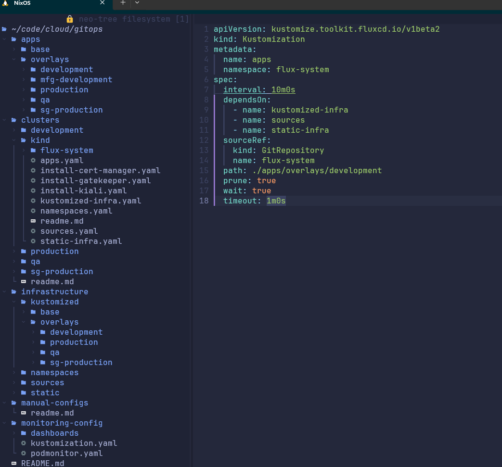
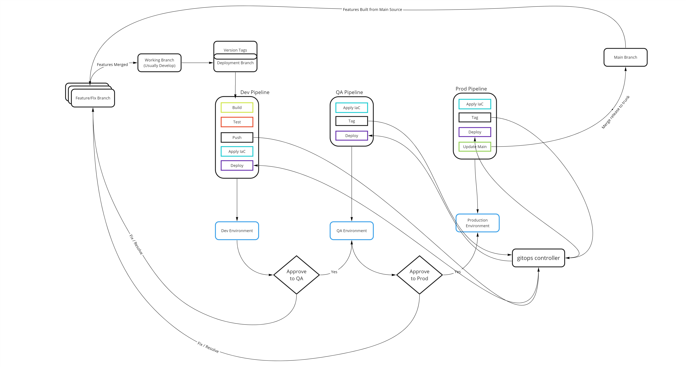

# gitops-service-example Repository

## THIS REPO DOES NOT WORK. 

### IT IS MEANT TO BE AN EXAMPLE OF A FLUX/FLAGGER CONFIGURATION
I'm not even saying it's a good example, it's just an example =). We cloned this from our internal repository and deleted most of our manifests. We tried to leave an example in each folder. 

Here's a screen shot of our full top level directory structure and our development `Apps` Manifest. .




### Things we may do a little differently
- We only build our containers before deploying to development. Every production container is compiled in Development and gets deployed to production exclusively by tags. Configurations are passed into the containers at runtime. 
  - The exception to this rule is frontends where we use debug build option in development.
- We don't deploy to main to trigger releases. We create an immutable release tag (Semantic Versioning). Our pipelines are configured to commit to main once a deployment is completed and revert if a deployment fails. This way, main always represents production. 

### Our High Level Build / Deploy Process


### Container Tagging Standards
*This is an excert from our internal "On Containerization" standards document.*
>Using `:Latest` is generally a bad idea and can create all kinds of issues in hosting. Instead we use Unique build tags and environment tags to manage our container infrastructure. 
>
>Environment tags are for letting the Flux know what containers are to be used
>
> - Example => `user-roles:production, user-roles:development, user-roles:qa`
>
>Unique tags are tags that represent a unique build process. We primarily use these tags programmatically to change the versions of containers we’re using in production. They consist of the Stable tag concatenated with a “.”, a timestamp (in UTC format w/ : stripped out), another '.' and the git hash of the source.
>
> - Example => `user-roles:v1.2.2.2022-01-15t161730814Z.9eabf5b536662000f79978c4d1b6e4eff5c8d785`

# Original Project Readme

## Overview

This is the master configuration repository for all of our k8s configurations. This repo contains all manifests for cluster building and maintenance. These configurations are implemented by [Flux CD](https://fluxcd.io/).

## Usage

### Folder Organization

- `./clusters` is a reserved directory where each managed cluster has it's configuration. This gives us the ability to selectively apply mannifest files per cluster. You can read more about how it works in the `clusters/readme.md`

- `./apps` is where we strore application manifests. Each application repo should have a manifest that is committed to this repo for deployments. This allows us to maintain a centralized state of the cluster

- `./infrastructure` is - you guessed it - where we store the core configurations for the cluster. There are several subdirectories that are used for different purposes. The order of installation is critical and is determined by the manifests at the root of the `./clusters/<cluster-name>` directory
  - `./infrastructure/kustomized` - these are dynamic configurations that vary per environment and are built when applied by the definition files in the `./clusters/<cluster-name>/` directory
  - `./infrastructure/namespaces` - This stores static namespace configurations for the clusters
  - `./infrastructure/sources` - This stores helm sources defintions that download helm packages to the local system
  - `./infrastructure/static` - This stores static infrastructure that doesn't vary by environment

### Ordering Operations

[Flux CD](https://fluxcd.io/) is not entirely smart enough to understand dependencies. In order to manage them, we create multiple manifests with declared dependencies in the `./clusters/<cluster-name>` folder.

### Managing Helm Installations

We create each helm installation as it's own manifest in the root of the `./clusters/<cluster-name>` directory so we can set dependencies for deployments. This is primarily necessary to address CRDs.

As an example, we can declare a manifest to install the install-aws-load-balancer-controller.yaml. Notice that it is referencing the install folder. This convention of breaking apart manifests into install and configure folders where helm is involved has proven useful.

```YAML
apiVersion: kustomize.toolkit.fluxcd.io/v1beta2
kind: Kustomization
metadata:
  name: aws-load-balancer-controller-install
  namespace: flux-system
spec:
  interval: 1m0s
  dependsOn:
  - name: sources
  - name: namespaces
  sourceRef:
    kind: GitRepository
    name: flux-system
  path: ./infrastructure/kustomized/base/aws-load-balancer-controller/install
  prune: true 
```

We can then declare a dependency in the manifest that installs kustomized infrastructure:

```yaml
apiVersion: kustomize.toolkit.fluxcd.io/v1beta2
kind: Kustomization
metadata:
  name: kustomized-infra
  namespace: flux-systemgit ver
spec:
  interval: 1m0s
  dependsOn:
  - name: sources
  - name: namespaces
  - name: cert-manager-install
  - name: kiali-install
  - name: aws-load-balancer-controller-install
  sourceRef:
    kind: GitRepository
    name: flux-system
  path: ./infrastructure/kustomized/overlays/development
  prune: true 

```

### Deploying a New Cluster

This is designed to be used in conjuctions with our custom EKS CLI.

1. Use the eks cli to create the cluster.
2. Checkout this repo 
3. Update the iam_role: key for each namespace manifest in the kustomized overlay folders to match the roles created in the cluster (e.g. `eksctl-dev-eks-core-nodegroup-ng-NodeInstanceRole-1IXH5OLFJVNQO`)
4. Bind gitops to the cluster:

```shell
flux bootstrap github \
    --owner=<owner> \
    --repository=gitops \
    --branch=main \
    --path=clusters/<cluster name>
```

**Note: \<cluster name> should be the name of the cluster that you want to bind. If binding a brand new environment, you may first need to define a new cluster under `clusters/\<cluster name>`

### Applying Changes

Changes are automatically applied every 5 minutes directly from the main branch of this repository. If you need to apply an interim change, the command is:

```shell
flux reconcile source git flux-system
```

### Checking Status

You can check the status of changes applied to the cluster by running the following command:

```shell
flux get ks -w
```

## Misc Notes and Discoveries While Using

This section is for engineers to add gotchas or other discoveries while using Flux-CD and the tools we have.

- When using cert-manager, even if you update the issuer to use real url, you will continue to get a staging certificate until you delete the secret
- Kustomize sometimes misses .yml files so it best to use .yaml consistently
